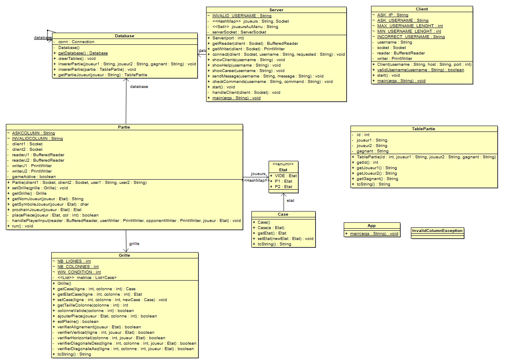

# SAE Réseau/Système

**Lucas THOMAS**  
**Ugo DOMINGUEZ**  
**Antony PERDIEUS**  
**Yasin KESKIN**

## Manuel d’utilisation

### Pour exécuter le Client :
```bash
gradle runClient
```

### Pour exécuter le Serveur :
```bash
gradle runServer
```

Lors de l’exécution du client, il faut tout d'abord renseigner l’adresse IP du serveur de jeu sur lequel on souhaite se connecter, puis choisir son nom de joueur.  

### Commandes disponibles :
- **`ls`** : Affiche la liste des joueurs connectés au serveur.  
- **`help`** : Affiche la liste des commandes disponibles avec une description.  
- **`career`** : Consulte l’historique des parties enregistrées dans la base de données, associé au pseudo actuel.  
- **`connect <nom joueur>`** : Défie un autre joueur pour lancer une partie.

---

## Choix techniques

Pour l’historique des joueurs, les informations sont stockées dans une base de données à partir du nom du joueur, ce qui permet de récupérer ces données depuis n’importe quelle session. Ce choix évite de limiter l’accès à une seule machine, comme cela aurait été le cas avec un stockage basé sur l’adresse IP.  

Pour la gestion de la base de données, nous avons utilisé **SQLite** avec **JDBC**, et le **pattern Singleton** a été utilisé pour garantir une gestion unique et centralisée de la base de données.  

Enfin, **Gradle** a été choisi pour gérer les dépendances, notamment entre JDBC et SQLite, et faciliter l’exécution du projet.

---

## Diagramme de classe 


---

## Protocole

Lors de l’exécution du programme, le serveur demande un nom à l’utilisateur.  

- Lorsque l’utilisateur utilise la commande `connect <nom joueur>`, le serveur lance la partie entre le client cible et le client ayant initié le défi.  
- La partie se déroule comme suit :  
  1. Le serveur envoie la grille de jeu aux deux joueurs.  
  2. Le joueur dont c’est le tour reçoit une demande de choix de colonne.  
  3. Tant que le joueur ne renvoie pas de choix valide, le serveur attend sa réponse.  
  4. Le processus continue jusqu’à ce qu’un des joueurs gagne ou qu’une égalité soit déclarée.  

- Pour afficher l’historique des parties, le serveur reçoit la requête `career` du client, interroge la base de données, puis envoie les informations au client.
